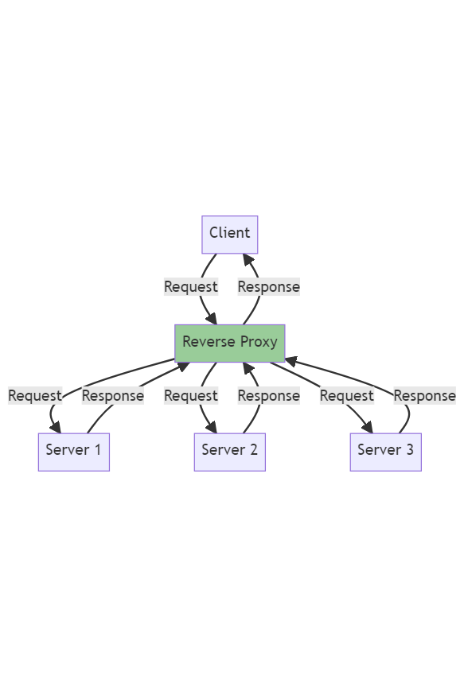

# Managing file ownership 2.8a

## Why is managing file ownership important?

Managing file ownership is crucial for security and access control. It ensures that sensitive files are only accessible to authorized users. Additionally, file ownership allows for accountability by identifying who made changes to a file.

## What is the command to view file ownership?

The command to view file ownership is `ls -l`. This command provides a long format listing that includes ownership information.

## What permissions are set when a user creates a file or directory? Who does the file or directory belong to?

When a user creates a file or directory, the permissions are set based on the default umask value. The file or directory belongs to the user who created it. By default, the owner is granted read and write permissions, while other users do not have any permissions.

## Why does the owner, by default, not receive X permissions when they create a file?

The owner does not receive execute (X) permissions by default when creating a file to prevent accidental execution of potentially harmful files. Execute permissions are typically given explicitly when necessary.

## What command is used to change the owner of a file or directory?

The command used to change the owner of a file or directory is `chown`. This command allows you to change the ownership to a specified user or group.

# Managing file permissions Task 2.8b

## Does being the owner of a file mean you have full permissions on that file?

Being the owner of a file does not necessarily mean having full permissions. The owner may have read, write, and execute permissions, but it depends on the specific permissions assigned to the file.

## If you give permissions to the User entity, what does this mean?

Giving permissions to the User entity means granting those permissions to the user who owns the file or directory. The User entity represents the owner of the file or directory.

## If you give permissions to the Group entity, what does this mean?

Giving permissions to the Group entity means granting those permissions to the group associated with the file or directory. Multiple users can belong to a group, and by assigning group permissions, these users gain the specified access rights.

## If you give permissions to the Other entity, what does this mean?

Giving permissions to the Other entity means granting those permissions to all other users who are neither the owner nor part of the group. The Other entity represents users who do not fall into the User or Group categories.

## You give the following permissions to a file: User permissions are read-only, Group permissions are read and write, Other permissions are read, write, and execute. You are logged in as the user which is the owner of the file. What permissions will you have on this file? Explain.

As the owner of the file, your permissions will be read-only. This is because the User permissions, which pertain to the file owner, are set to read-only. The permissions granted to the Group and Other entities, which allow for reading, writing, and executing, do not apply to you as the file owner.

## Here is one line from the ls -l. Work everything you can about permissions on this file or directory.

The line `-rwxr-xr-- 1 tcboony staff` details the permissions for the file or directory:

- The first character `-` indicates that it is a regular file.
- The subsequent characters `rwx` indicate that the owner (User entity) has read, write, and execute permissions.
- The characters `r-x` represent the read and execute permissions for the Group entity.
- The characters `r--` represent read-only permission for the Other entity.
- The number `1` indicates the number of hard links to the file or directory.
- `tcboony` is the owner (user) of the file or directory.
- `staff` is the group associated with the file or directory.

# Managing file permissions using numeric values 2.8c

## What numeric values are assigned to each permission?

The numeric values assigned to each permission are as follows: Read (r) is `4`, Write (w) is `2`, and Execute (x) is `1`.

## What can you do with the values assigned read + write permissions?

When the numeric values for read (`4`) and write (`2`) are added together, you get a total of `6`. This means you can both read the file's contents and modify (write to) the file.

## What value would assign read, write, and execute permissions?

The numeric value that would assign read, write, and execute permissions is `7` (4+2+1).

## What value would assign read and execute permissions?

The numeric value that would assign read and execute permissions is `5` (4+1).

## Often, a file or directory's mode/permissions are represented by 3 numbers. What do you think 644 would mean?

The value `644` represents the file or directory's permissions:

- The leftmost digit `6` represents the owner's permissions (read and write).
- The middle digit `4` represents the group's permissions (read-only).
- The rightmost digit `4` also represents read-only permissions for others.

# Changing file permissions 2.8d

## What command changes file permissions?

The command to change file permissions is `chmod` (Change Mode).

## To change permissions on a file, what must the end user be? (2 answers)

To change permissions on a file, the end user must be either the owner of the file or an administrator with the appropriate privileges.

## Give examples of some different ways/syntaxes to set permissions on a new file (named test.txt) to: Set User to read, Group to read + write + execute, and Other to read and write only

The following commands can be used to set permissions on a new file named `test.txt`:

- Using symbolic notation: `chmod u=r,g=rwx,o=rw test.txt`
- Using numeric notation: `chmod 764 test.txt`

## Add execute permissions (to all entities)

To add execute permissions to all entities, use the command: `chmod +x test.txt`

## Take write permissions away from Group

To remove write permissions from the Group entity, use the command: `chmod g-w test.txt`

## Use numeric values to give read + write access to User, read access to Group, and no access to Other

To use numeric values to give read + write access to User, read access to Group, and no access to Other, use the command: `chmod 640 test.txt`

# Linux Commands

- `cat chicken-joke.txt | grep chicken`

  - This command reads the contents of the file "chicken-joke.txt" and passes it to the `grep` command, which searches for the word "chicken" in the input and displays the matching lines.

- `apt install tree`

  - This command installs the "tree" package using the package manager "apt". Tree is a utility that displays the directory structure in a tree-like format.

- `sudo apt install tree`

  - Same as the previous command, but it runs with administrative privileges (sudo).

- `sudo apt-get update -y`

  - This command updates the package lists and upgrades the installed packages on the system. The "-y" flag automatically confirms any prompts during the update process.

- `cd /`

  - Changes the current directory to the root directory ("/").

- `mkdir del_temp`

  - Creates a new directory named "del_temp" in the current directory.

- `cd del_temp/`

  - Changes the current directory to the "del_temp" directory.

- `cd ..`

  - Moves up one directory level (to the parent directory).

- `rm -r del_temp/`

  - Deletes the "del_temp" directory and its contents recursively ("-r" flag).

- `mkdir funny-jokes`

  - Creates a new directory named "funny-jokes" in the current directory.

- `pwd`

  - Prints the current working directory (full path).

- `cd ../..`

  - Moves up two directory levels (to the grandparent directory).

- `mv chicken-joke.txt funny-stuff/funny-jokes/`

  - Moves the file "chicken-joke.txt" to the "funny-jokes" directory inside the "funny-stuff" directory.

- `mv chicken-joke.txt test-del.txt`

  - Renames the file "chicken-joke.txt" to "test-del.txt" in the current directory.

- `mv test-del.txt ../../`

  - Moves the file "test-del.txt" to the parent directory.

- `mv chicken-joke.txt funny-stuff/funny-jokes/`

  - Moves the file "chicken-joke.txt" to the "funny-jokes" directory inside the "funny-stuff" directory.

- `mv chicken-joke.txt ~/funny-stuff/`

  - Moves the file "chicken-joke.txt" to the "funny-stuff" directory in the user's home directory.

- `cp chicken-joke.txt bad-joke.txt`

  - Copies the file "chicken-joke.txt" and creates a new file named "bad-joke.txt" in the current directory.

- `mv bad-joke.txt ~/`

  - Moves the file "bad-joke.txt" to the user's home directory.

- `rm -r funny-stuff/`
  - Deletes the "funny-stuff" directory and its contents recursively ("-r" flag).

### Linux Commands

#### System Update and Package Management

- `sudo apt upgrade`

  - This command is used to upgrade all upgradable packages on the system.

- `sudo apt install nginx`
  - This command is used to install the 'nginx' package.

#### Nginx Service Management

- `sudo systemctl start nginx`

  - Starts the 'nginx' service.

- `sudo systemctl restart nginx`

  - Restarts the 'nginx' service.

- `sudo systemctl enable nginx`

  - Enables the 'nginx' service to start on boot.

- `sudo systemctl is-enabled nginx`

  - Checks whether the 'nginx' service is enabled to start on boot.

- `sudo systemctl status nginx`
  - Checks the status of the 'nginx' service.

#### Shell Scripts

- `./provision.sh`

  - Executes the 'provision.sh' shell script in the current directory.

- `nano provision.sh`

  - Opens the 'provision.sh' file in the nano text editor.

- `cat provision.sh`
  - Displays the content of 'provision.sh' file in the terminal.

#### Environment Variables

- `printenv`

  - Prints all environment variables.

- `printenv USER`

  - Prints the 'USER' environment variable.

- `MYNAME=zain`

  - Sets the 'MYNAME' environment variable to 'zain'.

- `echo "hello"`

  - Prints "hello" to the console.

- `echo $MYNAME`

  - Prints the value of 'MYNAME' environment variable.

- `export MYNAME=zain`

  - Exports the 'MYNAME' environment variable so it is available to child processes.

- `export MYCATSNAME=Silkie`

  - Exports the 'MYCATSNAME' environment variable so it is available to child processes.

- `printenv MYCATSNAME`
  - Prints the 'MYCATSNAME' environment variable.

#### Process Management

- `ps`

  - Displays the current running processes.

- `exit`
  - Exits the current shell.

#### User's Bash Environment

- `nano .bashrc`

  - Opens the '.bashrc' file in the nano text editor.

- `tail -5 .bashrc`

  - Shows the last 5 lines of the '.bashrc' file.

- `source .bashrc`
  - Loads the '.bashrc' file, applying any changes made.

#### Terminal History

- `history`
  - Shows the history of commands that have been entered in the terminal.

kill - 9 command:

- brute force method.

## Copy file to VM

`scp -i ~/.ssh/tech241-zain-az-key app.zip adminuser@51.11.137.173:~/`
`<Path to private key><Path to file you want to transfer><username and public ip of machine>:<path you want to store file>`

## provision.sh

#!/bin/bash

# update source list

sudo apt update -y

# upgrade all the packages and installs them in the kernal

sudo apt upgrade -y

# install nginx

sudo apt install nginx -y

# start nginx

sudo systemctl start nginx

# status nginx

# sudo systemctl status nginx

# Linux Commands Explanation

## NSG rules

- Added port 3000 to the NSG rules on azure website.
- Inbound port rule

## Process Management

- **ps aux**: Display detailed information about all the current running processes in the system. The 'aux' option shows processes for all users, in a user-oriented format.

- **sleep**: Pause for an amount of time. The number following the command is the number of seconds to pause. For example, `sleep 3` pauses for 3 seconds.

- **jobs**: Display the status of jobs in the current session.

- **jobs -l**: List the current jobs along with their process IDs.

- **kill**: Terminate processes. The number following the command is the process ID to terminate. The `-1` and `-9` are signals specifying how to terminate the process. `-1` is a hangup signal, and `-9` is a kill signal.

- **ps -ef**: Display a full listing of all current processes.

- **kill -1 4528**: Sends a HUP (hang up) signal to the process with ID 4528.

- **kill -15 4528**: Sends a TERM (terminate) signal to the process with ID 4528.

- **kill -9 4528**: Sends a KILL signal to the process with ID 4528.

## File Management

- **nano**: Open the file in the nano text editor. For example, `nano provision.sh` opens the file `provision.sh` in the nano text editor.

- **ls**: List the files and directories in the current directory.

- **rm**: Remove files or directories. The `-r` option is used to remove directories and their contents recursively.

- **cd**: Change the current directory. `cd` without any arguments changes to the home directory.

- **mv**: Move or rename files or directories. For example, `mv app app-scp` renames the directory `app` to `app-scp`.

- **rm -rf app-github/**: Recursively removes the `app-github` directory and its contents.

## Git Commands

- **git --version**: Display the installed version of Git.

- **git clone**: Clone the Git repository at the provided URL into a new directory in the current location. For example, `git clone https://github.com/Zain-Ashfaq/tech241-sparta-app` clones the specified Git repository.

## Node.js and npm Commands

- **curl -sL https://deb.nodesource.com/setup_12.x | sudo -E bash -**: Downloads and runs the NodeSource setup script for Node.js 12.x.

- **sudo apt install nodejs -y**: Installs Node.js using the apt package manager.

- **sudo npm install pm2 -g**: Installs the pm2 process manager globally using npm.

- **npm install**: Installs the dependencies listed in the `package.json` file in the current directory.

- **npm start**: Runs the script named "start" defined in the `package.json` file in the current directory.

## Other Commands

- **history**: Display the command line history.

- **clear**: Clears the terminal screen.

`bindIp: 0.0.0.0` - only for testing - allows any machine to connect

# Mongodb script

## System Update and Upgrade

- **sudo apt update -y**: Update the list of available packages and their versions, but it does not install or upgrade any packages.

- **sudo apt upgrade -y**: Install newer versions of packages currently installed on the user's system from the sources enumerated in /etc/apt/sources.list.

## MongoDB Installation and Configuration

- **wget -qO - https://www.mongodb.org/static/pgp/server-3.2.asc | sudo apt-key add -**: Download the MongoDB GPG public key and add it to the apt program keyring.

- **echo "deb http://repo.mongodb.org/apt/ubuntu xenial/mongodb-org/3.2 multiverse" | sudo tee /etc/apt/sources.list.d/mongodb-org-3.2.list**: Add the MongoDB repository to the apt sources list.

- **sudo apt-get install -y mongodb-org=3.2.20 mongodb-org-server=3.2.20 mongodb-org-shell=3.2.20 mongodb-org-mongos=3.2.20 mongodb-org-tools=3.2.20**: Install specific versions of MongoDB packages.

- **sudo nano /etc/mongod.conf**: Open the MongoDB configuration file in the nano text editor.

- **cat /etc/mongod.conf**: Display the contents of the MongoDB configuration file.

## MongoDB Service Management

- **sudo systemctl status mongod**: Check the status of the MongoDB service.

- **sudo systemctl start mongod**: Start the MongoDB service.

- **sudo systemctl enable mongod**: Enable the MongoDB service to start on boot.

- **sudo systemctl restart mongod**: Restart the MongoDB service.

## Process Management

- **ps**: Display the status of the current processes in the terminal.

- **ps aux**: Display detailed information about all the current running processes in the system.

- **kill -9 14483**: Sends a KILL signal to the process with ID 14483.

- **sudo kill -9 14483**: Sends a KILL signal to the process with ID 14483 with root privileges.

## Other Commands

- **history**: Display the command line history.

- **sudo systemctl restart nginx**: Restart the Nginx service.

## Connecting to Mongodb

# Environment Variable Configuration

- **export DB_HOST=mongodb://172.187.178.145:27017/posts**: This command sets the `DB_HOST` environment variable to the provided MongoDB connection string. This environment variable can then be used in your application to connect to the MongoDB database. The connection string specifies that MongoDB is running on the host at IP address `172.187.178.145` and listening on port `27017`. The `/posts` at the end of the connection string specifies the `posts` database.

# App Installation and Setup Script

This script automates the installation and setup of a Node.js application and configures Nginx as a reverse proxy. It performs the following steps:

1. **Update Package List**: The script first updates the package list to ensure that the latest versions of all packages are available.

   ```bash
   sudo apt update -y
   ```

2. **Upgrade Packages**: The script then upgrades all installed packages to their latest versions.

   ```bash
   sudo apt upgrade -y
   ```

3. **Install Nginx**: The script installs Nginx, a popular web server.

   ```bash
   sudo apt install nginx -y
   ```

4. **Configure Nginx**: The script enables Nginx to start on boot, starts the Nginx service, and then modifies the default Nginx configuration to set up a reverse proxy to `localhost:3000`.

   ```bash
   sudo systemctl enable nginx
   sudo systemctl start nginx
   sudo sed -i 's|try_files $uri $uri/ =404;|proxy_pass http://localhost:3000;|' /etc/nginx/sites-available/default
   sudo systemctl restart nginx
   ```

5. **Download Node.js**: The script downloads and installs Node.js.

   ```bash
   curl -sL https://deb.nodesource.com/setup_12.x | sudo -E bash -
   sudo apt install nodejs -y
   ```

6. **Set DB_HOST Environment Variable**: The script sets the `DB_HOST` environment variable, which is used by the application to connect to its MongoDB database.

   ```bash
   export DB_HOST=172.187.178.145:27017/posts
   ```

7. **Install PM2**: The script installs PM2, a process manager for Node.js applications.

   ```bash
   sudo npm install -g pm2
   ```

8. **Clone Application**: The script clones the application's code from a GitHub repository.

   ```bash
   git clone https://github.com/jungjinggg/tech241_sparta_app app-github-automation
   ```

9. **Install Application Dependencies**: The script installs the application's Node.js dependencies.

   ```bash
   cd ~/app-github-automation/app
   npm install -y
   ```

10. **Start Application**: The script starts the application using PM2.

    ```bash
    pm2 start app.js --name "sparta-app"
    ```

This script installs Node.js, Nginx, and PM2, sets up a reverse proxy to `localhost:3000` using Nginx, clones a Node.js application from a GitHub repository, installs its dependencies, and starts the application using PM2. The `DB_HOST` environment variable is set to the IP address and port of a MongoDB database.

# Use & instead of PM2

```bash
nohup npm start &
```

The nohup command is used to run a command immune to hangups, and & is used to run the command in the background.

Before you can run the same command again, you need to ensure that the previous instance of the application is stopped or terminated. Otherwise, attempting to run the command again will result in an error because the application is already running.

# MongoDB Installation Script

This script automates the installation and setup of MongoDB on a Ubuntu system. It performs the following steps:

1. **Update Package List**: The script first updates the package list to ensure that the latest versions of all packages are available.

   ```bash
   sudo apt update -y
   ```

2. **Upgrade Packages**: The script then upgrades all installed packages to their latest versions.

   ```bash
   sudo apt upgrade -y
   ```

3. **Import MongoDB GPG Key**: The script imports the MongoDB public GPG key, which is used by the package management system to verify the integrity of the packages.

   ```bash
   wget -qO - https://www.mongodb.org/static/pgp/server-3.2.asc | sudo apt-key add -
   ```

4. **Add MongoDB Repository**: The script adds the MongoDB repository to the list of sources from which packages can be installed.

   ```bash
   echo "deb [ arch=amd64 ] https://repo.mongodb.org/apt/ubuntu xenial/mongodb-org/3.2 multiverse" | sudo tee /etc/apt/sources.list.d/mongodb-org-3.2.list
   ```

5. **Update Package List**: The script updates the package list again to include the packages from the newly added MongoDB repository.

   ```bash
   sudo apt update -y
   ```

6. **Install MongoDB**: The script installs MongoDB and its associated tools.

   ```bash
   sudo apt-get install -y mongodb-org=3.2.20 mongodb-org-server=3.2.20 mongodb-org-shell=3.2.20 mongodb-org-mongos=3.2.20 mongodb-org-tools=3.2.20
   ```

7. **Update MongoDB Configuration**: The script updates the MongoDB configuration to allow connections from any IP address.

   ```bash
   sudo sed -i 's/bindIp: 127.0.0.1/bindIp: 0.0.0.0/' /etc/mongod.conf
   ```

8. **Start MongoDB**: The script starts the MongoDB service.

   ```bash
   sudo systemctl start mongod
   ```

9. **Enable MongoDB on Boot**: The script enables MongoDB to start on boot.

   ```bash
   sudo systemctl enable mongod
   ```

# Nginx and Reverse Proxy Guide

## What are ports?

Ports are an endpoint of communication in an operating system. While IP addresses are used to identify the machine or host in a network, ports are used to identify specific processes or services running on that host. For example, web servers typically listen on port 80 for HTTP traffic and port 443 for HTTPS traffic.

## What is a reverse proxy? How is it different to a proxy?

A proxy server is a server that acts as an intermediary for requests from clients seeking resources from other servers. A client connects to the proxy server, requesting some service, such as a file, connection, web page, or other resources available from a different server and the proxy server evaluates the request as a way to simplify and control its complexity.

A reverse proxy, on the other hand, appears to the client just like an ordinary web server. No special configuration on the client is necessary. The client makes a request to the reverse proxy, which then decides where to route that request. The reverse proxy can forward it to different servers, providing a level of load balancing, or it can provide a single point of access to an application spread across many servers.

## What is Nginx's default configuration (hint - 'sites-available' directory)

Nginx's default configuration is stored in a file typically located at /etc/nginx/nginx.conf. However, for managing server blocks (similar to virtual hosts in Apache), Nginx uses two directories: sites-available and sites-enabled. The sites-available directory contains configuration files for all your server blocks, while the sites-enabled directory contains links to the configuration files that Nginx will actually read and run. By default, there is a default server block file in the sites-available directory.

## How do you set up a Nginx reverse proxy?

Setting up an Nginx reverse proxy involves several steps:

1. Install Nginx on your server.
2. Modify the Nginx configuration file (located at /etc/nginx/sites-available/default).
3. In the configuration file, within a location block, use the proxy_pass directive to specify the address of the proxied server. For example, to proxy requests to a server running on localhost at port 3000, you would add proxy_pass http://localhost:3000;.
4. Save the configuration file and exit the text editor.
5. Test the configuration to make sure there are no syntax errors with `sudo nginx -t`.
6. If the configuration test is successful, reload Nginx to apply the changes with `sudo systemctl reload nginx`.

Now, when you access your server's public IP address in a web browser, you should be served the application running on localhost at port 3000.


In this diagram, the client sends a request to the reverse proxy, which then decides where to route that request. The reverse proxy can forward it to different servers (Server 1, Server 2, Server 3 in the diagram), providing a level of load balancing. Once the servers respond, the reverse proxy sends the response back to the client.

# blob storage

resource group -> storage account -> container(s) -> blobs
redundancies: not essential for a program to run - backup copies of things incase of a disaster, you can fall back on it.

# Azure Blob Storage

## A. What is it?

Azure Blob Storage is a service for storing large amounts of unstructured object data, such as images, documents, video etc.

## B. Difference between Blob Storage and Hierarchical File Storage

Blob Storage is an object storage system which treats files as blobs or 'Binary Large Objects'. It doesn't maintain a hierarchy or directory structure like traditional file systems in Linux/Windows/Mac. Each blob is stored in a flat namespace within a storage account and identified by a unique name.

## C. Advantages/Disadvantages of Blob Storage

Advantages:

- **Scalability**: Blob storage can handle large amounts of data.
- **Accessibility**: Data in blob storage is accessible from anywhere in the world via HTTP or HTTPS.
- **Security**: Azure provides strong security measures to protect your data.

Disadvantages:

- **Cost**: Depending on the amount of data and access frequency, costs can be high.
- **Complexity**: It can be more complex to manage and organize data due to the lack of a hierarchical structure.

## D. Different Tiers and Cost

- **Hot tier**: For data that is accessed frequently.
- **Cool tier**: For data that is infrequently accessed and stored for at least 30 days.
- **Archive tier**: For data that is rarely accessed and stored for at least 180 days.

## E. Parts of Azure Blob Storage

- **Account**: The Azure account under which the blob storage is created.
- **Container**: A container provides a grouping of a set of blobs. All blobs must be in a container.
- **Blobs**: A blob is a file of any type and size.

The relationship is as follows: An account can contain multiple containers, and a container can hold multiple blobs.

# Azure Block Blob Storage Redundancy Types

Azure's block blob storage offers several types of data redundancy to ensure durability and high availability. Here are the different types:

## 1. Locally Redundant Storage (LRS)

LRS provides at least 99.999999999% (11 9's) durability of objects over a given year. With LRS, data is replicated within a single data center in a single region.

## 2. Zone-Redundant Storage (ZRS)

ZRS provides the same durability percentage as LRS. However, data is replicated synchronously across three Azure availability zones in the same region.

## 3. Geo-Redundant Storage (GRS)

GRS provides 99.99999999999999% (16 9's) durability and includes the replication of data to a secondary region that is hundreds of miles away from the primary region.

## 4. Read-Access Geo-Redundant Storage (RA-GRS)

RA-GRS provides the same durability as GRS. In addition, it allows for read access to data in the secondary region, providing higher availability.

## 5. Geo-Zone-Redundant Storage (GZRS)

GZRS combines the features of GRS and ZRS by providing replication across availability zones and to a secondary region.

## 6. Read-Access Geo-Zone-Redundant Storage (RA-GZRS)

RA-GZRS is similar to GZRS but also provides read access in the secondary region, offering the highest availability.

Each redundancy option is designed to meet different needs and comes with its own cost implications. It's important to understand these differences when choosing the right redundancy for your application.

# Creating a blob

## 1. Create a storage account

```
az storage account create --name tech241zainstorage --resource-group tech241 --location uksouth --sku Standard_LRS
```

## 2. List all storage accounts in a resource group

```
az storage account list --resource-group tech241
```

## 3. List all storage accounts in a resource group with specific attributes

```
az storage account list --resource-group tech241 --query "[].{Name:name, Location:location, Kind:kind}" --output table
```

## 4. Create a container

```
az storage container create --account-name tech241zainstorage --name testcontainer
```

## 5. Upload a blob

```
az storage blob upload --account-name tech241zainstorage --container-name testcontainer --name newname.txt --file test.txt --auth-mode login
```

## 6. List all blobs in a container

```
az storage blob list --account-name tech241zainstorage --container-name testcontainer --output table --auth-mode login
```
